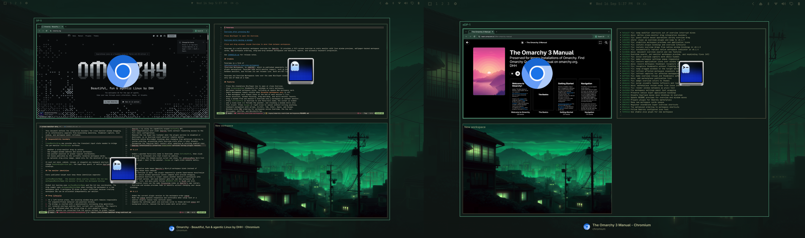

# Overview Workspaces



*Press Win/Super to open the Overview.*


*Click and drag windows inside Overview to move them between workspaces.*

Overview Workspaces is an Omarchy Quattro experience-enhancement plugin. It provides a full-screen workspace overview with live window previews, wallpaper-backed workspace cards, dynamic workspace ordering, native workspace ordering, drag-and-drop movement, and automatic keyboard integration.

See [`CHANGELOG.md`](CHANGELOG.md) for release notes.

## Marketplace

Overview Workspaces has been approved and verified in the Omarchy plugin marketplace:
[open the published marketplace page](https://plugins.omarchy.org/plugin.html?id=hancore.overview-workspaces).

## Features

- Press the standalone Win/Super key to open or close Overview.
- Live `ScreencopyView` thumbnails for windows on every workspace.
- Wallpaper-backed workspace cards, including an opaque New workspace card.
- Empty workspaces remain visible when using native ordering.
- A New workspace card always stays at the end of each monitor's list.
- Mouse selection, window focusing, drag-and-drop, and multi-monitor layouts.
- Press `Ctrl+Shift+X` in Overview to arm force-kill mode; the cursor is hidden
  and a close icon (`󰅖`) follows the pointer, and clicking a window kills only
  that client. Press `Escape` or right-click to cancel without killing anything.
- Keyboard navigation with arrows, H/J/K/L, Tab, Enter, Space, and Escape.
- Windows-style MRU ordering for workspaces across Overview, the top bar,
  Win+number, Win+Tab, and Win+Shift+Tab.
- Search for applications, open windows, and Omarchy menu actions from Overview.
- Per-monitor workspace previews, configurable from the gear panel.
- Right-click any part of the top-bar workspace widget to open Overview as a
  mouse fallback when the keyboard shortcut is unavailable.
- Re-registers its runtime bindings after a Hyprland configuration reload.
- Omarchy theme colors and configured icon font.
- No generic fallback icon is drawn over a window thumbnail when an app has no icon.

## Install

```sh
omarchy plugin add https://github.com/iamcheyan/omarchy-overview-workspaces.git --enable
```

After enabling, the plugin registers its Hyprland bindings automatically. Users do not need to edit `~/.config/hypr/bindings.lua`.

After updating an existing enabled installation, restart Omarchy Shell once so
the new keybinding service code replaces the preserved `keepLoaded` instance:

```sh
omarchy restart shell
```

A plugin rescan alone does not replace that service instance. Do not use a
Hyprland reload as a substitute.

Enabling automatically replaces the built-in workspace indicator; disabling restores it through Omarchy's native replacement mechanism. Older hosts that injected the full shell configuration also retain the legacy duplicate-layout cleanup.

## Ordering modes

Open the gear button in the top bar to choose a mode.

**Occupied workspaces only**

- Workspaces with windows are displayed in Windows-style MRU order.
- Win+1 through Win+0 follow those visual slots.
- The New workspace card always stays last.
- The top bar and Overview use the same order.

**System native order**

- Keeps occupied workspaces in MRU order while also showing native empty slots.
- Empty workspaces 1–10 remain visible.
- Existing workspaces 11, 12, 13, and higher remain visible.
- Native IDs are not renumbered.
- Native Win+number behavior is restored while Overview and Win+Tab remain available.

Changing the mode updates the top bar, Overview, and keyboard behavior together.

## Search

Open Overview with the standalone Win/Super key, then press `/` to enter search.
Type an application name, window title, or Omarchy menu action and press Enter
to launch or focus the selected result. Use the arrow keys or Tab to move the
selection, and Escape to leave search.

H/J/K/L remain workspace navigation keys by default. To restore the older
behavior where any printable character starts search, turn off **Keep h/j/k/l
for navigation** in the gear panel. Prefix a query with `>` to run it as a
terminal command.

The search index reads Omarchy's menu through `$OMARCHY_PATH`, so it does not
assume `/usr/share/omarchy` and can be used on NixOS installations.

## Keyboard integration and cleanup

The enabled plugin service registers standalone Win, Win+Tab, Win+Shift+Tab, optimized Win+number slots, and Super-interrupt guards for normal application shortcuts.

When the plugin is disabled or removed, the service removes the fixed shortcut
chords it manages and restores Omarchy's default workspace navigation and
Super+mouse move/resize. Hyprland's runtime unbind API has no plugin-owner
identity, so a custom user mapping on the same chord cannot be preserved by
this cleanup. The service never runs `hyprctl reload` or writes runtime binds
into the user's Hyprland configuration.

## Manual summon and diagnostics

```sh
omarchy-shell shell summon hancore.overview-workspaces '{}'
hyprctl layers | grep -A3 -B2 'quickshell:overview'
omarchy plugin list --json | jq '.[] | select(.id == "hancore.overview-workspaces")'
```

## Project files

- `Overview.qml` — Overview layer-shell surface and lifecycle.
- `OverviewWidget.qml` — workspace grid, wallpaper, borders, selection, and drag targets.
- `OverviewWindow.qml` — window geometry, live thumbnails, and app icons.
- `WorkspaceNavigation.qml` — keyboard navigation, focus, and drag commits.
- `OverviewSwitchingController.qml` — Win+Tab switching and commit behavior.
- `WorkspaceOrder.qml` — persistent optimized workspace ordering.
- `HyprlandData.qml` — workspace, monitor, and window state mapping.
- `SettingsPanel.qml` — ordering-mode settings panel.
- `KeybindingService.qml` — automatic shortcut registration and cleanup.

## Validation

The complete repeatable validation procedure is documented in
[`docs/validation.md`](docs/validation.md). It covers automated tests, plugin
validation, QML checks, Shell IPC, layer checks, mouse fallback behavior,
stability cycles, and recovery isolation.

```sh
omarchy plugin validate .
qmllint -I "${OMARCHY_PATH:-/usr/share/omarchy}/shell" \
  Overview.qml OverviewWidget.qml OverviewWindow.qml \
  SettingsPanel.qml KeybindingService.qml bar/widget.qml
node --test
```
